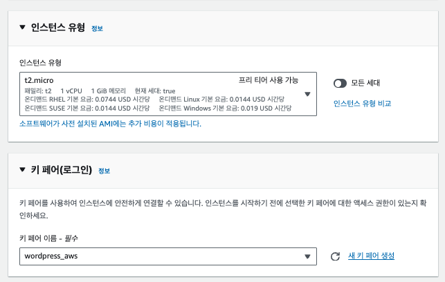
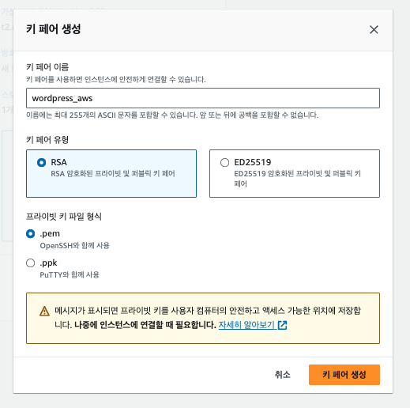
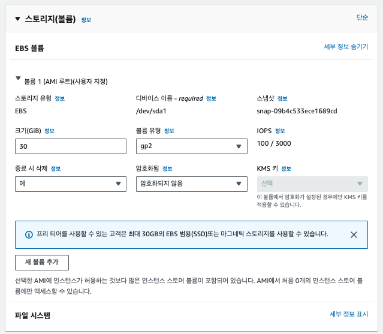
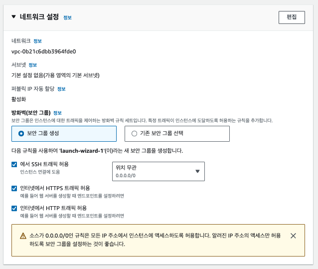
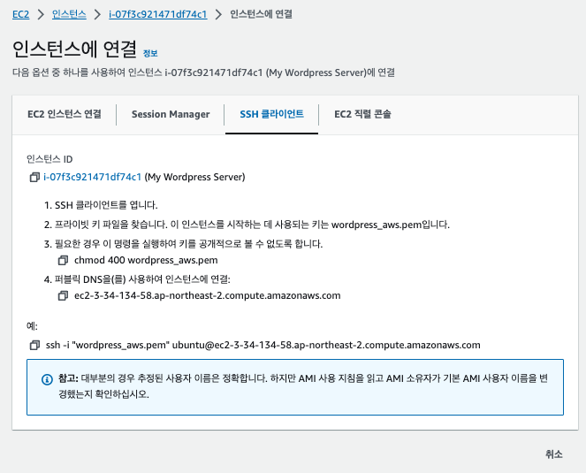

- [aws 프리티어 회원가입](#aws-프리티어-회원가입)
- [ec2 만들기](#ec2-만들기)
- [ec2접속](#ec2접속)
  - [권한 내리기](#권한-내리기)
  - [접속](#접속)

# aws 프리티어 회원가입

myemail@gmail.com 으로 프리티어가 끝났다.
- myemail+2023@gmail.com 으로 또 가입이 가능하다.
- myemail+2023 으로 가입하면, 이메일은 myemail으로 오고, AWS 프리티어는 이메일 기준으로 제공되니 무한 프리티어 가능.

# ec2 만들기

- 이름, 우분투 선택  

  

  

- ec2접속을 위한 키 생성

- 30기가 까지 무료로 사용가능

- HTTP/S 접근 허용

# ec2접속

## 권한 내리기
chmod 400 wordpress_aws.pem
( -rw-r--r-- > -r-------- )

## 접속
ssh -i "wordpress_aws.pem" ubuntu@ec2-3-34-134-xx.ap-northeast-2.compute.amazonaws.com

